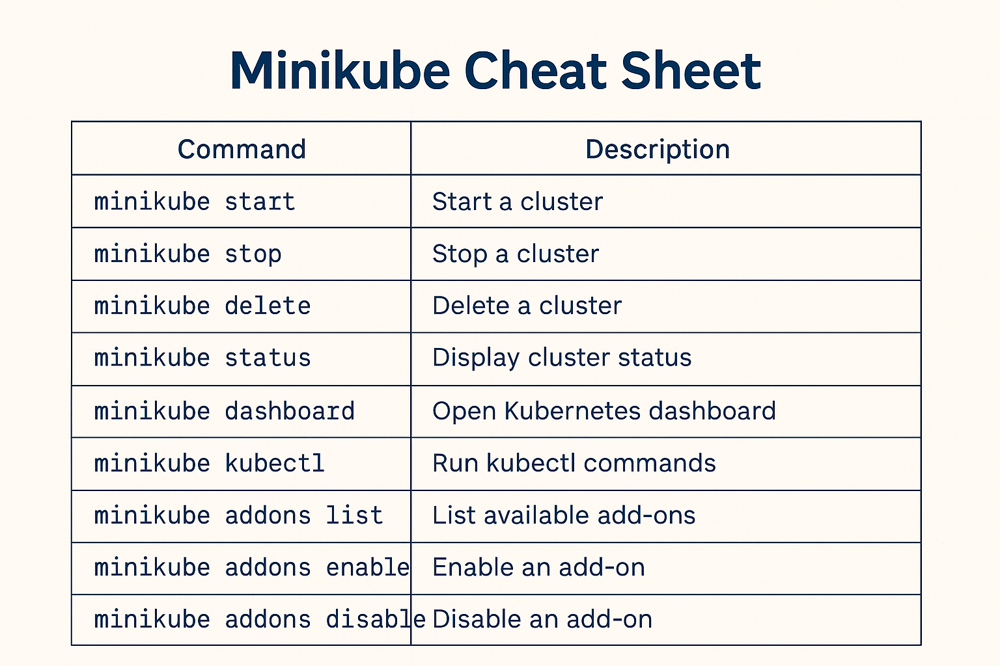

# Guía paso a paso para usar Kubernetes de forma local con Minikube

Esta guía te mostrará cómo usar **Kubernetes** de manera local con la herramienta **Minikube**. Minikube crea un clúster de Kubernetes de un solo nodo en tu máquina, lo que te permite experimentar y probar Kubernetes sin necesidad de una infraestructura compleja.

## Requisitos previos

1. **Sistema Operativo**: Linux, macOS o Windows.
2. **Requisitos de hardware**: Al menos 2GB de RAM y 20GB de espacio libre en disco.
3. **Herramientas necesarias**:
   - **Docker**: Minikube usa Docker para crear y administrar los contenedores. [Descargar Docker](https://www.docker.com/products/docker-desktop).
   - **kubectl**: Herramienta de línea de comandos para interactuar con Kubernetes. [Instalar kubectl](https://kubernetes.io/docs/tasks/tools/).
   - **Minikube**: Herramienta para crear el clúster local de Kubernetes. [Instalar Minikube](https://minikube.sigs.k8s.io/docs/).

## Paso 1: Instalación de Minikube

Dependiendo de tu sistema operativo, sigue las instrucciones de instalación.

### Para Linux (usando `apt`):

```bash
sudo apt update
sudo apt install -y curl wget apt-transport-https
curl -LO https://storage.googleapis.com/minikube/releases/latest/minikube-linux-amd64
sudo mv minikube-linux-amd64 /usr/local/bin/minikube
sudo chmod +x /usr/local/bin/minikube
```

### Para macOS (usando Homebrew):

```bash
brew install minikube
```

### Para Windows (usando choco):

```bash
choco install minikube
```

## Paso 2: Iniciar Minikube

Una vez instalado Minikube, inicia el clúster local con el siguiente comando:

```bash
minikube start
```

Minikube descargará la imagen del clúster y creará una máquina virtual para emular un entorno de Kubernetes en tu máquina local.

## Paso 3: Verificar la instalación de Kubernetes

Verifica que el clúster está corriendo correctamente con el siguiente comando:

```bash
kubectl cluster-info
```

Este comando debe mostrar la URL del clúster y confirmar que está activo.

## Paso 4: Comprobar los nodos de Kubernetes

Puedes verificar los nodos en tu clúster con el siguiente comando:

```bash
kubectl get nodes
```

Esto debe mostrar un único nodo con el estado Ready si Minikube ha iniciado correctamente.

## Paso 5: Desplegar una aplicación en Kubernetes

Vamos a crear un despliegue básico de nginx como ejemplo:

```bash
kubectl create deployment nginx --image=nginx
```

Esto creará un Deployment llamado nginx, utilizando la imagen oficial de nginx.

### Exponer el servicio

Para exponer el servicio y acceder a la aplicación, usa el siguiente comando:

```bash
kubectl expose deployment nginx --type=NodePort --port=80
```

Esto abrirá el puerto 80 en tu máquina local, permitiéndote acceder a la aplicación.

### Verificar el servicio expuesto

Para obtener la URL de tu servicio, usa:

```bash
minikube service nginx --url
```

Esto devolverá una URL como http://192.168.99.100:30000, que podrás abrir en tu navegador para ver la aplicación.

## Paso 6: Acceder al Dashboard de Kubernetes (opcional)

Minikube ofrece una interfaz gráfica para gestionar tu clúster. Para acceder al Dashboard, ejecuta:

```bash
minikube dashboard
```

Esto abrirá el Dashboard en tu navegador, donde podrás ver y gestionar los recursos de tu clúster.

## Paso 7: Detener el clúster de Minikube

Cuando hayas terminado, puedes detener el clúster con el siguiente comando:

```bash
minikube stop
```

Esto apagará la máquina virtual creada por Minikube.

## Paso 8: Eliminar el clúster de Minikube (opcional)

Si deseas eliminar el clúster y liberar recursos, usa:

```bash
minikube delete
```

Este comando eliminará la máquina virtual y todos los recursos asociados.


